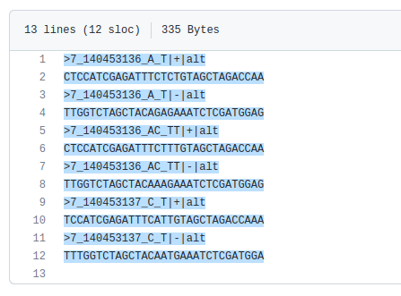
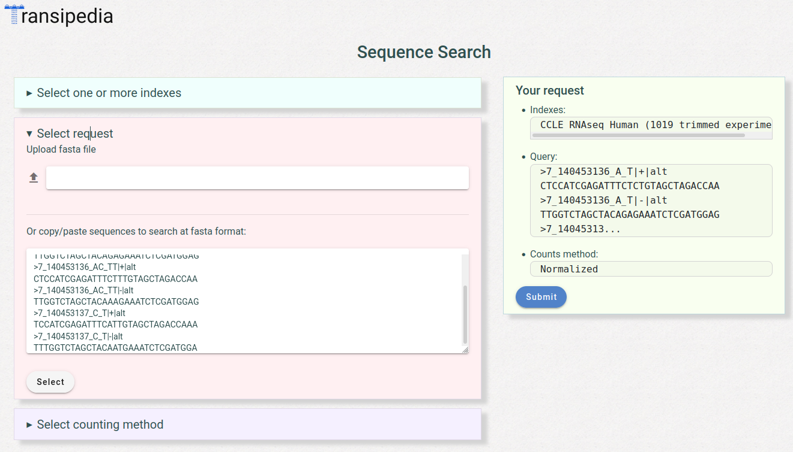
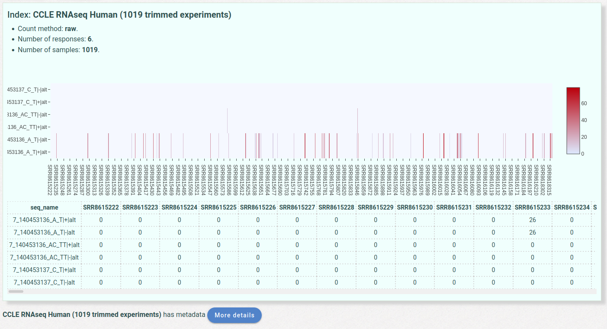
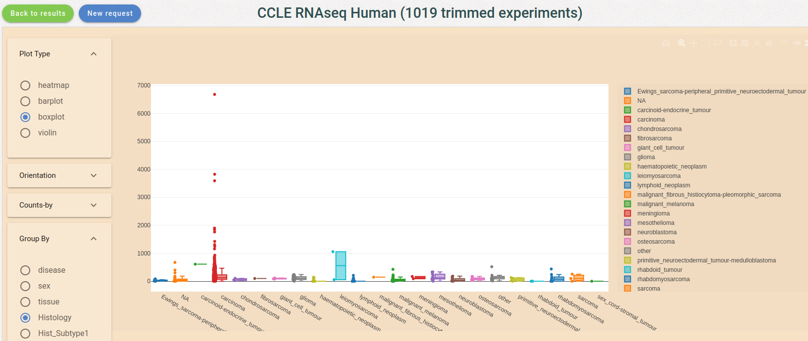
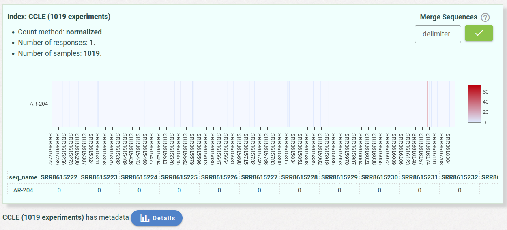
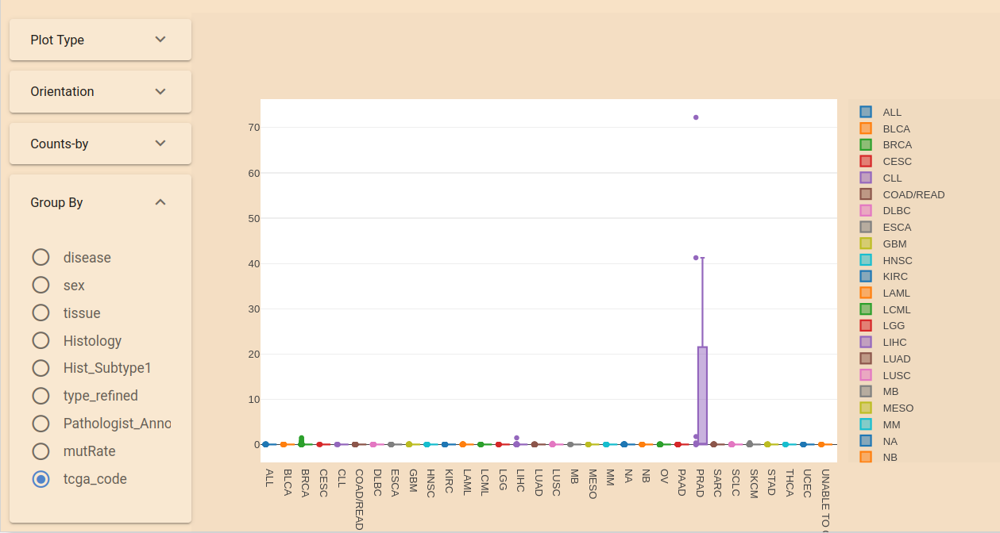

# Reindeer use cases

* [use-case 1](#use-case-1-mutation-sequence-search)
* [use-case 2](#use-case-2-spliced-junction-sequence-search)


An increasing number of public RNA-seq datasets are now available with more than  500,000 RNA-seq libraries listed on the SRA repository, over 7000 species. This huge body of publicly available RNA-­seq libraries is a treasure of functional information.
The objective of the Transipedia project is to provide the scientific community with a new way to obtain insights from OMICS data that may deliver results not obtainable through traditional means. Organizing large scale data collection is performed towards REINDEER, that builds a data-structure that indexes k-mers and their abundances from a collection of raw RNA-seq. The TranSipedia web site then provides a high flexibility for producing smart information  from big data.  
With **Reindeer-uses-cases**, we propose to highlight TranSipedia flexibility and computational efficiency that make it attractive as a new transcriptional profiling approach for a wide variety of applications.

## Sequence search at Transipedia web site

1. Select one or several indexes.
2. Select the sequence mode: 
	* sequences can be submitted as input by cut-paste step in a fasta format. 
	* The sequences could be kmers of at least 31nt length or longer sequences (see test sequences with Try it), 
	* The user can upload a list of sequences of interest in a fasta file. The maximum size of the request file is 1MB. For bigger datasets, the user needs to  interrogate the index from command line using [Reindeer](https://github.com/kamimrcht/REINDEER/blob/master/README.md) directly.
3. Select the counting method: `raw` or `normalized` counts (kmer count/total kmers).
4. `Submit` the request.
5. Select the metadata button `More details` when available.


## USE-CASE 1: mutation sequence search

1. Copy the contain of [BRAF_V600.fa](https://github.com/Transipedia/Reindeer-use-cases/blob/main/BRAF_V600.fa).  
	  
	The provided list corresponds to altered/mutated sequences from BRAF gene. 
The most frequent mutations in the CCLE dataset (V600) were selected from the 
DepMap file  [CCLE_mutations.csv](https://depmap.org/portal/download/all/) 
(release 21Q4). The 31nt kmers were constructed with 
[seqTailor](http://shiva.rockefeller.edu/SeqTailor/) from the vcf information.
    
2. Open the [Transipedia web site](https://transipedia.org).
3. In the **Indexes** area, select `CCLE RNAseq (1019 experiments)`.
4. In the **Request** area, remove the example requests and paste the previously selected requests, click on `Select`.  
     
5. optionnally, select the counting method in **Counting method** area.
6. Check your selection in the ``Your request`` area.
7. Click on `Submit`
8. Select `More details`  at the bottom of the page  
    
9. Select `Histology` in `group by` box and then `Boxplot`
    
    You will obtain this graph that confirms the presence of BRAF_V600 mutation mainly observed in Carcinoma and melanoma. 
    You can then check  the kmer specificity on Indexes form normal cells (wt).


## USE-CASE 2: spliced junction sequence search

The query sequence was the 60-nt fragment spanning exon 3-4 junction, specific 
to androgen receptor variant AR-V7 (Gencode transcript AR-204).

This spliced junction is most frequently expressed in PRAD tumors ([https://europepmc.org/article/med/31055861](https://europepmc.org/article/med/31055861)).


1. Copy the the spliced junction fasta sequence below:

```
>AR-204 (AR V7) E3-4
AATGTTATGAAGCAGGGATGACTCTGGGAGAAAAATTCCGGGTTGGCAATTGCAAGCATC
```


2. Open the [Transipedia web site](https://transipedia.org).
3. In the **Indexes** area, select CCLE RNAseq.
4. In the **Request** area, remove the example requests and paste the previously selected requests, 
click on ``Select``.
5. Optionnally, select the counting method in **Counting method** area.
6. Check your selection in the ``Your request`` area.
7. Click on ``Submit`` in ``Your request``.
    
8. Select **More details** at the bottom of the page.
9. In **Group By** box, select ``tcga_code`` and then ``Boxplot`` in **Plot Type**. You will obtain 
a graph that confirms the presence of BRAF_V600 mutation specifically  observed in PRAD. You can 
then check the kmer specificity on Indexes form normal cells (type **wt** keyword in the index 
search bar).
    


